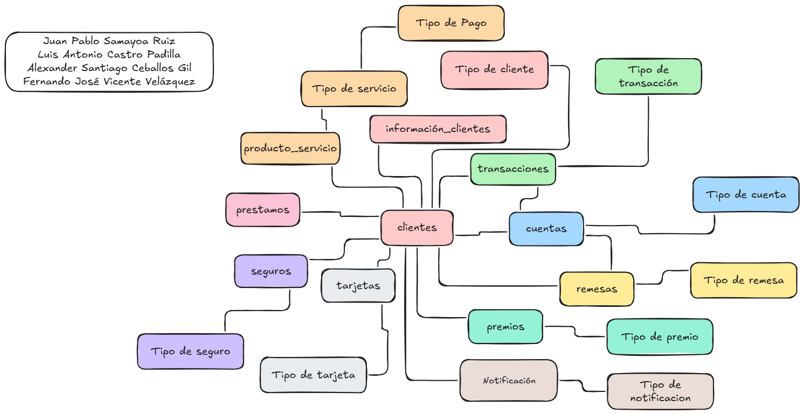
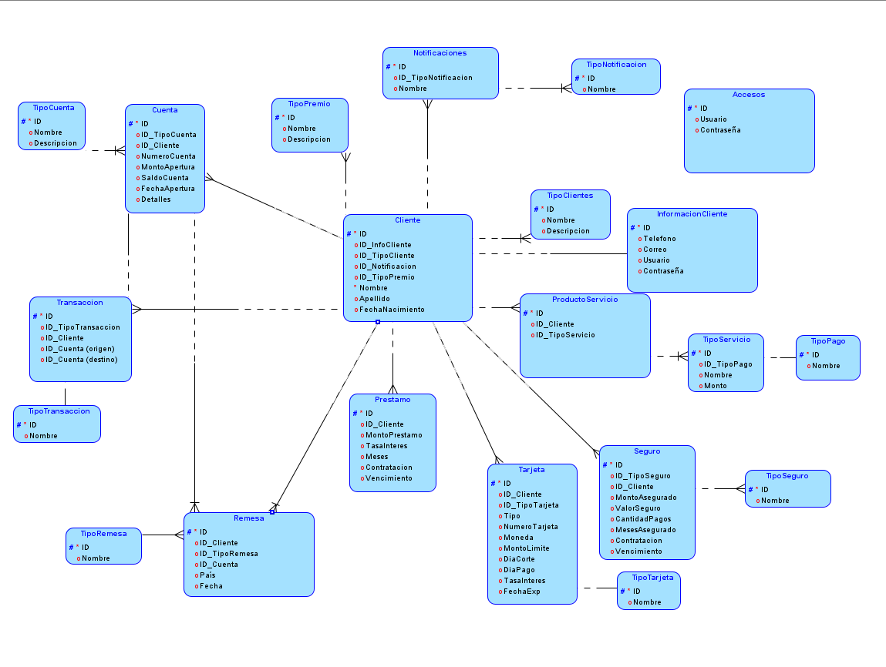
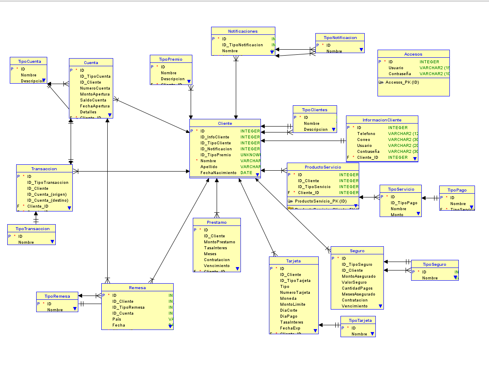

# SBD1_1S2025_Proyecto2
## Integrantes

| Integrante | Carnet |
|:----------:|:--------:|
| Juan Pablo Samayoa Ruiz|202109705|
| Luis Antonio Castro Padilla|202109750|
| Alexander Santiago Ceballos Gil|202109812|
| Fernando Jose Vicente Velazquez | 202111576|

## [Normalización](Documentacion/Normalizacion.md)

## [Diagrama Matricial](https://docs.google.com/spreadsheets/d/1S-JJFgE-3fcANa7I2AZoZ8lDxy8ltLcqVcZWUxx0AaY/edit?gid=0#gid=0) 

## [Modelo conceptual](https://excalidraw.com/#room=6f150733d13193c513ac,By9S7lJURBhKRDqM8dEiTQ)

## Modelo Físico

## Modelo Relacional
