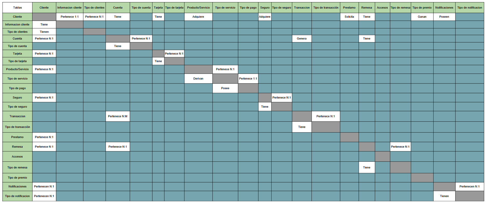

# SBD1_1S2025_Proyecto2
## Integrantes

| Integrante | Carnet |
|:----------:|:--------:|
| Juan Pablo Samayoa Ruiz|202109705|
| Luis Antonio Castro Padilla|202109750|
| Alexander Santiago Ceballos Gil|202109812|
| Ferando Jose Vicente Velazquez | 202111576|

## [Normalización](https://docs.google.com/spreadsheets/d/1f16YnQG2YKnyX1V256X8wvoE_17a_PSemrwIO546g6Q/edit?usp=sharing)
## [Modelo conceptual](https://excalidraw.com/#room=6f150733d13193c513ac,By9S7lJURBhKRDqM8dEiTQ)
## [Modelo Físico](./Documentacion/ModeloFisico.png)
## [Modelo Relacional](./Documentacion/ModeloRelacional.png)
## Diagrama Matricial
